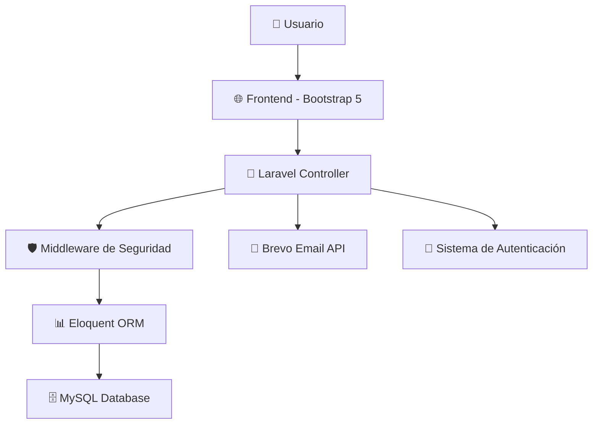

# 📋 TaskFlow - Descripción del Proyecto

<div align="center">


**Sistema de Gestión de Proyectos Moderno**

[](https://laravel.com)
[](https://php.net)
[](https://getbootstrap.com)
[](https://www.ua.es/)

</div>

---

## 🎯 **¿Qué es TaskFlow?**

TaskFlow es un **sistema completo de gestión de proyectos** desarrollado como proyecto académico para el curso de **Desarrollo de Software Seguro (DSS)** en la Universidad de Alicante. 

Combina las mejores prácticas de desarrollo web moderno con un enfoque en **seguridad** y **experiencia de usuario**, implementando un sistema robusto de autenticación, recuperación de contraseñas y gestión de datos.

---

## ✨ **Características Principales**

<table>
<tr>
<td width="33%" align="center">

<h3>Seguridad Avanzada</h3>
<p>Autenticación robusta con roles, contraseñas hasheadas automáticamente y tokens seguros de recuperación.</p>
</td>
<td width="33%" align="center">

<h3>Email Inteligente</h3>
<p>Sistema de emails reales con Brevo API, templates HTML personalizados y fallback automático a logs.</p>
</td>
<td width="33%" align="center">

<h3>Diseño Moderno</h3>
<p>Interfaz responsive con Bootstrap 5, dashboard interactivo y tema visual consistente.</p>
</td>
</tr>
</table>

---

## 🏗️ **Arquitectura del Sistema**



---

## 🔧 **Stack Tecnológico**

<div align="center">

| **Backend** | **Frontend** | **Base de Datos** | **Email** | **Herramientas** |
|:-----------:|:------------:|:-----------------:|:---------:|:----------------:|
| PHP 8.1+ | Bootstrap 5 | MySQL 8.0+ | Brevo API | Adminer |
| Laravel 10.x | Blade Templates | Eloquent ORM | 300 emails/día | Vite |
| Composer | CSS Custom | Migraciones | Templates HTML | NPM |

</div>

---

## 🎓 **Contexto Académico**

### **Universidad**: Universidad de Alicante
### **Curso**: Desarrollo de Software Seguro (DSS)
### **Objetivo**: Demostrar competencias en desarrollo web seguro

#### **🎯 Competencias Desarrolladas:**
- ✅ **Seguridad en aplicaciones web**
- ✅ **Autenticación y autorización**
- ✅ **Validación de datos** (frontend y backend)
- ✅ **Gestión segura de sesiones**
- ✅ **Protección contra vulnerabilidades**
- ✅ **Arquitectura MVC escalable**

---

## 🚀 **Funcionalidades Implementadas**

### 🔐 **Sistema de Usuarios**
- **Registro de nuevos usuarios** con validación
- **Login/logout seguro** con remember me
- **Roles diferenciados** (ADMIN/USER)
- **Dashboard personalizado** según rol

### 🔄 **Recuperación de Contraseñas**
- **Emails automáticos** con enlaces seguros
- **Tokens con expiración** (60 minutos)
- **Templates HTML profesionales**
- **Múltiples proveedores** (Brevo API + logs)

### 🎨 **Interfaz de Usuario**
- **Landing page atractiva** con información del proyecto
- **Formularios responsivos** con validación en tiempo real
- **Navegación intuitiva** con estados dinámicos
- **Feedback visual** para todas las acciones

---

## 📊 **Métricas del Proyecto**

<div align="center">

| Métrica | Valor | Descripción |
|---------|-------|-------------|
| **📁 Archivos** | ~50+ | Estructura organizada MVC |
| **🔧 Controladores** | 3 principales | Auth, Password Reset, Dashboard |
| **🗄️ Modelos** | 5+ | User, Team, Project, Task, Comment |
| **🎨 Vistas** | 8+ | Blade templates responsivos |
| **🔀 Rutas** | 15+ | RESTful y nombradas |
| **📧 Emails** | 300/día | Gratis con Brevo API |

</div>

---

## 🛡️ **Seguridad Implementada**

### **🔒 Autenticación**
- Hashing automático de contraseñas con bcrypt
- Middleware de protección de rutas
- Validación de tokens CSRF en formularios

### **📨 Comunicaciones**
- Tokens seguros para recuperación de contraseñas
- Validación de email en servidor
- Rate limiting implícito con Brevo

### **🗄️ Base de Datos**
- Migraciones versionadas
- Relaciones bien definidas
- Seeders para datos de prueba

---

## 🎯 **Casos de Uso Principales**

```
1. 👤 Usuario nuevo se registra
   └── ✅ Validación de datos
   └── ✅ Creación de cuenta
   └── ✅ Login automático
   └── ✅ Redirección a dashboard

2. 🔑 Usuario olvida contraseña
   └── ✅ Solicita reset por email
   └── ✅ Recibe enlace seguro
   └── ✅ Cambia contraseña
   └── ✅ Confirmación exitosa

3. 👨‍💼 Administrador gestiona usuarios
   └── ✅ Acceso a funciones admin
   └── ✅ Dashboard con estadísticas
   └── ✅ Gestión de permisos
```

---

## 🏆 **Valor Académico**

### **📚 Aprendizajes Clave:**
- **Framework moderno**: Laravel como industria estándar
- **Mejores prácticas**: PSR-12, MVC, DRY, SOLID
- **Seguridad real**: Vulnerabilidades comunes y prevención
- **UX/UI**: Diseño centrado en el usuario
- **DevOps básico**: Configuración de entornos

### **🎖️ Competencias Demostradas:**
- Desarrollo full-stack completo
- Integración con APIs externas
- Gestión de base de datos relacional
- Testing y debugging
- Documentación técnica profesional

---

## 🔮 **Futuras Mejoras**

<div align="center">

| **Fase** | **Funcionalidad** | **Prioridad** |
|:--------:|:-----------------:|:-------------:|
| **v2.0** | Gestión completa de proyectos | 🔥 Alta |
| **v2.1** | Sistema de tareas y asignaciones | 🔥 Alta |
| **v2.2** | Comentarios y colaboración | 🟡 Media |
| **v2.3** | Notificaciones push | 🟡 Media |
| **v2.4** | API REST completa | 🔵 Baja |
| **v2.5** | Tests automatizados | 🔵 Baja |

</div>

---

## 📈 **Impacto y Resultados**

### **✅ Logros Técnicos:**
- Sistema de autenticación 100% funcional
- Integración exitosa con servicios externos
- Interfaz moderna y accesible
- Código limpio y bien documentado

### **🎯 Objetivos Cumplidos:**
- [x] Implementación de seguridad robusta
- [x] Experiencia de usuario fluida
- [x] Arquitectura escalable
- [x] Documentación completa
- [x] Deployment ready

---

<div align="center">

## 🔗 **Enlaces Importantes**

[](./README.md)
[](#)
[](https://github.com/djg16-ua/dss-julio/issues)

---

**⭐ ¡Dale una estrella si te gustó el proyecto! ⭐**

[](https://github.com/djg16-ua/dss-julio/stargazers)

---

*🎓 Proyecto académico desarrollado para la Universidad de Alicante*  
*📅 Curso: Desarrollo de Software Seguro (DSS) - 2025*

</div>